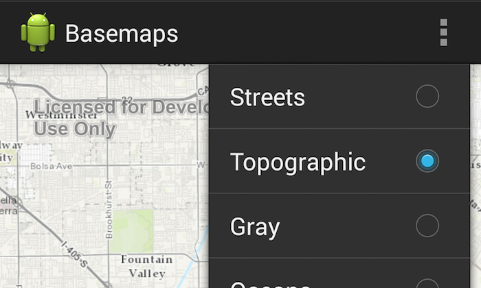

# Basemaps



The Basemaps sample app shows how you can switch basemaps offered in the ```ActionBar``` overflow button.

## Features
* MapView
* MapOptions
* MenuItem

## Sample Design
The ```ActionBar``` overflow button lists a group of basemaps to choose from.  The Basemap types are made available from the ```MapOptions.MapType``` ```Enum```.  The ```MapView.setMapOptions()``` takes the ```MapType``` as a parameter to switch basemaps. The ```setExtent()``` and ````setOnStatusChangedListener()``` methods on the ```MapView``` are used to preserve the current extent of the map when the basemap is changed.
