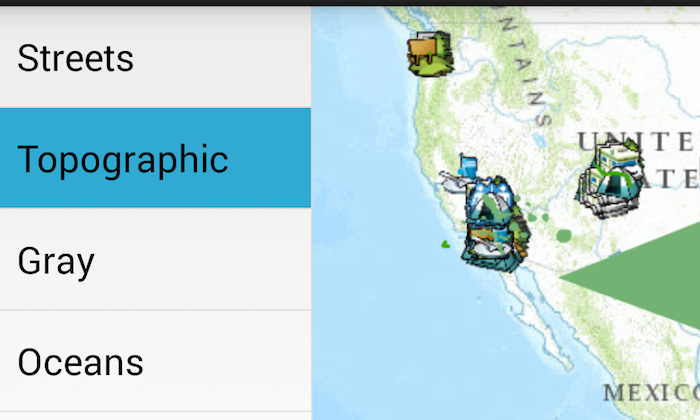

# Fragment Management

The purpose of this sample is two-fold: to demonstrate switching between one Fragment when in portrait orientation and two Fragments when in landscape orientation and to demonstrate use of Fragment.setRetainInstance() to retain map layer objects when orientation is changed.

It displays a list of basemaps, then displays a map containing the selected basemap plus 3 feature layers. In portrait orientation the map takes up the whole screen and you must press the Back key or the Home button on the action bar to return to the list. But in landscape orientation the list and the map are displayed side by side. The MapView has to be recreated when orientation changes, but the objects containing the map layers are retained so data does not need to be fetched from the network again.

## Sample Design

### FragmentManagementActivity

This sample has one activity, **FragmentManagementActivity**, which is responsible for creating and managing two fragments, one to display the list of basemaps and the other to display the map.

It sets the content view to R.layout.main. When the device is in portrait orientation the single-frame layout in layout/main.xml is used, but in landscape orientation the two-frame layout in layout-land/main.xml is used instead.

The activity onCreate() method determines how many panes to use by trying to find a View called map_fragment_container_twopane which is present only in the two-pane layout. 

In single-pane mode there is just one container view, called main_fragment_container. The activity initially places a list fragment in it, then replaces it by a map fragment when a basemap is selected. This is replaced by the list fragment again when the map is dismissed, but the map fragment is retained for future use.

In two-pane mode there are 2 container views: main_fragment_container for the list fragment and map_fragment_container_twopane for the map fragment.

When orientation changes, the activity is destroyed and onCreate() is called again. It removes/detaches the current fragment(s) and replaces them in container(s) as appropriate for the new orientation.

The activity acts upon the following UI events:
- Selection of a basemap from the list is handled by onBasemapSelected(). It is passed on to the map fragment and the map fragment is displayed if it's not already on screen.
- A press on the Home button in the action bar is handled by onOptionsItemSelected(). This causes return from map fragment to list fragment when in single-pane mode.
- A press on the Back key is handled by onBackPressed(). This causes return from map fragment to list fragment when in single-pane mode, or finishes the activity if the list fragment was already displayed.

### BasemapListFragment

**BasemapListFragment** extends ListFragment and presents a list of basemaps. The host activity passes in an integer argument being the currently selected position in the list. This is used to highlight the current basemap when in two-pane mode. The activity must also implement a BasemapListListener interface consisting of an onBasemapSelected() method that is called when a basemap is selected.

### MapFragment

**MapFragment** extends Fragment and displays map layers in a MapView. The host activity passes in a String argument being the name of the basemap to use.

The onCreate() method calls **setRetainInstance(true)** which causes the fragment instance to be retained when the Activity is destroyed and recreated. This allows map Layer objects to be retained when the orientation changes.

The onCreateView() method always creates a new MapView object, because any old MapView would be tied to an old Activity that has been destroyed, but it reuses existing Layer objects (if any) so the data they contain will not need to be fetched from the network again.

The destroyView() method releases the MapView resources by calling MapView.recycle(), but first it must remove all the layers or they too will be released by recycle().

A public method changeBasemap() is used by the activity to update the basemap when a new one is selected from the list when in two-pane mode.

