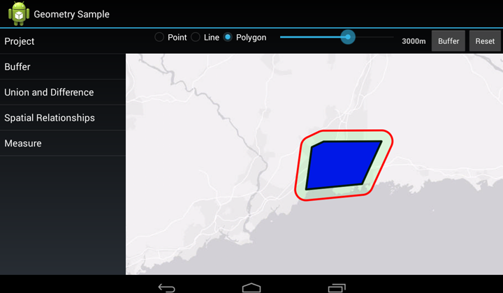

# Geometry Sample

This sample uses the Geometry engine in different ways to show off the capabilities the Geometry engine provides the user. The samples illustrate the use of following operations: Buffer, Union, Difference, and identification of Spatial Relationships. Each fragment lets the user explore these individually. The sample allows the user to draw geometries and modify them using each of the operations.

## Features
* Buffer Points, Lines, & Polygons
* Find the Union and Difference between intersecting Polygons
* Determine spatial relationships between polygons, e.g. touches, contains, etc.
* Android Fragments

## Sample Design 
The sample has an opening Geometry Sample Activity which presents the different geometry tools you can use in the app.  Choose a feature tool from the left hand [ListFragment](http://developer.android.com/reference/android/app/ListFragment.html) to open the feature tool and use it.  

### Note
This sample exclusively targets the tablets because of its UI design.
