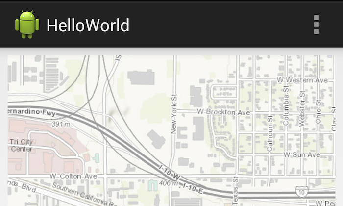

# Hello World



The HelloWorld app is the most basic Map app for the [ArcGIS Runtime SDK for Android](https://developers.arcgis.com/en/android/). 
It shows how to define a MapView in the layout XML of the activity. 
Within the XML definition of the ```MapView```, ```MapOptions``` attributes are used to populate that ```MapView``` with a basemap layer showing streets, and also the initial extent and zoom level are set.
By default, this map supports basic zooming and panning operations. 
This sample also demonstrates calling the ```MapView``` **pause** and **unpause** methods from the ```Activity``` ```onPause``` and ```onResume``` methods, which suspend and resume map rendering threads.
A reference to the ```MapView``` is set within the ```onCreate``` method of the ```Activity``` which can be used at the start template to build your first application.

## Features
* MapView
* MapOptions