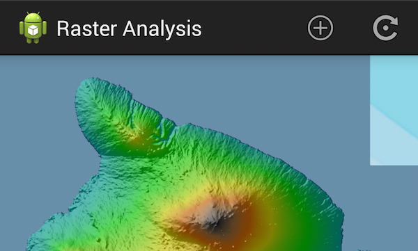

# LocalRasterData



The LocalRasterData app showcases the raster capabilities in the [ArcGIS Runtime SDK for Android](https://developers.arcgis.com/en/android/). It aims to be a starting off point for developers looking to extend the raster features with the ArcGIS Android. It demonstrates how to read raster data stored on your device and apply a renderer to a raster layer.

## Features
* FileRasterSource
* RasterLayer
* RasterRenderer
* StretchRenderer
* RGBRenderer
* HillshadeRenderer
* BlendRenderer

## Sample Design
A RasterLayer is constructed using a ```FileRasterSource``` which represents the raw raster file on a device. It can be added to the map to allow the raw raster file to be rendered. The ```RasterLayer``` can be added to a ```MapView``` as a basemap layer or operational layer. On-the-fly reprojection on ```FileRasterSource``` is performed before instantiating a ```RasterLayer``` from the ```FileRasterSource``` to handle different spatial references when adding the layer as operational layer.  ArcGIS Runtime Layers support changing it's renderer.  ```RasterRenderer``` is the interface that all the renderers must implement. You apply the renderer through the ```RasterLayer.setRenderer()``` method.

## How to use Sample
Sample opens up with a default streetmap basemap with spatial reference [4326](http://spatialreference.org/ref/epsg/wgs-84/).  You can add a raster dataset in the following ways:

* basemap layer - This option will replace the current basemap and use the raster dataset file as your basemap
* operational layer - This option will overlay your raster data on top of existing basemap
* elevation source - This option will use your raster dataset as the elevation source for rendering on an existing raster dataset using BlendRenderer. You must have a raster dataset representing your elevation area as a basemap layer.
* basemap and elevation - This option will replace your current basemap and use the raster dataset file as your basemap and elevation source of applying BlendRenderer on and existing raster dataset.
* operational and elevation - This options will overlay your raster data on top of the  existing basemap and elevation source of applying BlendRenderer on and existing raster dataset.

After you have added your raster datasets you can set the rendering.  There are 4 rendering options available from the ```ActionBar``` renderer button.

* Blend renderer
* Hillshade renderer
* RGB renderer
* Stretch renderer

Choose which renderer you want to use and complete the renderer dialog to perform update the raster.  

