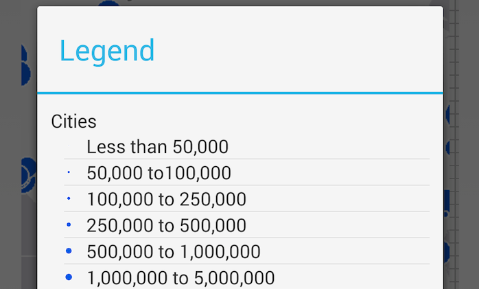

# MapLegend



THe Map Legend samples shows how to create a custom legend displaying the layers and feature displays

## Features
* ArcGISDynamicMapServiceLayer
* ArcGISLayerInfo
* Legend

## Sample Design
The ```MainActivity``` displays an ```ArcGISDynamicMapServiceLayer``` with 3 layers and one of which has a renderer. The ```ActionBar``` information button opens up a ```LegendDialogFragment`` displaying the 3 layers and the class breaks renderer on the Cities layer.
