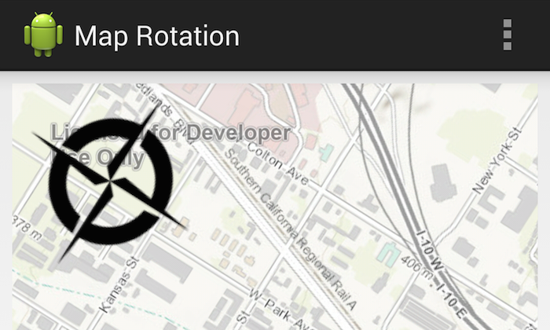

# Map Rotation



The Map Rotation sample app shows how to allow a user to rotate a map, and also shows a compass that displays the current map rotation angle. The ```setAllowRotationByPinch``` method allows rotation of the map using a pinch gesture; the current angle of rotation is then retrieved from the ```MapView``` using ```getRotationAngle```. A custom ```View``` showing a compass image is added to the map, which rotates itself in response to the ```OnPinchListener``` set on the ```MapView```. An ```OnSingleTapListener``` allows the map rotation angle to be reset to 0 by tapping on the map.

## Features
* MapView
* OnPinchListener
* Compass

