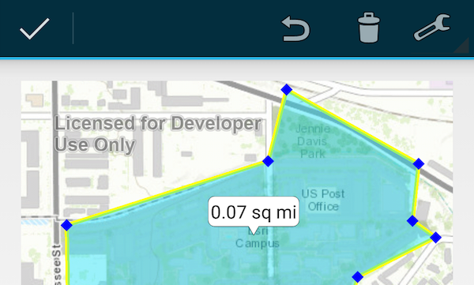

# Measure Tool



The Measure Tool sample follows Android's [Contexual Action Bar](http://developer.android.com/design/patterns/actionbar.html#contextual) design pattern to provide basic measuring and sketching capabilities in a self-contained tool.

## Sample Design:
The ```MeasuringTool``` can be integrated into an existing app provided the following two requirements are met:

1. An active ```MapView``` in you app
2. An [Action Bar](http://developer.android.com/design/patterns/actionbar.html) implemented in your app

### Steps to wire the measure tool to an Action Bar:
1. Copy the ```MeasuringTool``` java class to your applications projects ```src``` folder.
2. Create a new action button, which typically can be achieved by adding a ```MenuItem``` to the menu xml that populates the Action Bar.

```xml
 <item
   android:id="@+id/action_measure"
   android:icon="@android:drawable/ic_menu_edit"
   android:orderInCategory="100"
   android:showAsAction="ifRoom"
   android:title="@string/measure"/>
```

3. Add the following code snippet to your ```Activity``` or ```Fragment``` that contains the ```MapView``` to start the ```MeasuringTool``` when the Action Button is clicked.

```java
 @Override
 public boolean onOptionsItemSelected(MenuItem item) {
   switch (item.getItemId()) {
     case R.id.action_measure:
       startActionMode(new MeasuringTool(mapView));
       break;
     default:
       break;
   }
   return super.onOptionsItemSelected(item);
 }
```

The symbols used to draw the lines and polygons can be customized by calling:

```setLineSymbol(LineSymbol symbol)```
```setMarkerSymbol(MarkerSymbol symbol)```
```setFillSymbol(FillSymbol symbol)```

The linear and area units in the drop down list can be customized by calling:

```setLinearUnits(Unit[] linearUnits)```
```setAreaUnits(Unit[] areaUnits)```

The sample provides a ```MapActivity``` class to show an example implementation.  The ```MapActivity``` class shows an example of extending the ```MeasuringTool``` with custom units and custom symbols.

