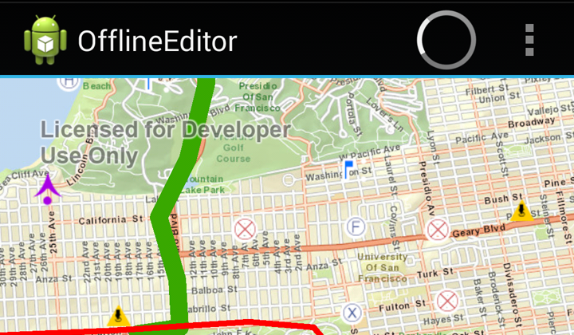

# Offline Editor:
You can access and edit data on your Android device even when you have no internet connection.  The purpose of this sample is to demonstrate how to download feature data for offline use,  edit the features geometry with feature templates, and synchronize your edits with a ArcGIS Server Feature Service. 



The sample includes the following utility classes:

* GDBUtil
* TemplatePicker.

# Sample Design:

The ```OfflineEditorActivity``` class sets up the layout and default map layers in the ```onCreate()``` method. The map layers and their service end points are defined in ```GDBUtil.java```. The layout provides the action bar with **Download/Online** and **Edit** buttons.

## Buttons

* Download - This button allows you to download feature data from the online feature service and provision the data locally to your device as a .geodatabase file.  Once the download is complete the app automatically updates with the downloaded feature data overlayed with the tile package  (*.tpk if you have this installed locally on the device.  The download button is replaced with an online button when you are in offline mode while the **Edit** button becomes available. 
* Edit - Opens the edit tools [Contextual Action Bar](http://developer.android.com/design/patterns/actionbar.html#contextual).
	* **Edit Template** button opens the **Feature Templates* dialog to allow you to select a feature template to edit the map with.  
	* **Save**
	* **Undo**
	* **Discard**
	* **Synchronize**
	* **Check** button closes the edit tools contextual action bar
 
## User Workflow
### Edit
To get started you need to download the feature data to your device using the **Download** button.  The app will automatically switch to data provisioned on your device once the download is complete.  Next you can start to edit the feature data by tapping the **Edit** button which opens the edit tools.  Using the edit tools, tap on the edit template button to select a feature template and place your feature template on the map. The geometry editing process is similar to the one documented in the [GeometryEditor](https://developers.arcgis.com/android/sample-code/geometry-editor/) Sample.
You can tap on the map to perform the edits and once the action is performed you have a an option to **Save** or **Undo** the last action. 

### Sync
Once the edits are performed locally, you can click on the **Synchronize** button to sync the local edits to the online Feature Service. You also have the option to discard all the changes made when tapping the **Discard** button. 

### Switch between On/Offline
When you return back to the initial ```ActionBar``` you can decide to go back online using the **Online** button, this then allows you to delete previously downloaded geodatabases so you can start again, or leave the data in place, in which case it will be used next time you go offline.  You must turn wifi back on if you made your edits offline and are attempting to sync them back.

## Sample Requirements
The OfflineEditor sample depends on the [Android Support Library](https://developer.android.com/tools/support-library/index.html). Instructions for setting that it up prior to running the app is detailed below. 

### Steps
 1. Create a new Sample project for OfflineEditor. Refer to the How to work with samples documents to create a new sample project.
 2. Right click the sample project and select Android Tools > Add Support Library
 3. Accept packages to install and click Install
 4. Under Android Dependencies you should see the android-support-v4.jar file library
 5. Right click the sample project and select Properties
 6. Select the Java Build Path on the left hand side then select Order and Export in the Java Build Path tabs
 7. Make sure Android Dependencies is checked
 8. Run the application

# Data:
The OfflineEditor sample is an example of working with data in an offline setting.  The sample depends on basemap data to be located on the device. This includes installing a local tile map cache (tpk) to device as described below:

1. Download Basemap data from ArcGIS Online - http://www.arcgis.com/home/item.html?id=9a7e015149854c35b5eb94494f4aeb89 
2. Create the the sample data folder at the root <storage> folder on your device, /{device-externalstoragepath}/ArcGIS/samples/OfflineEditor.  
3. Push the downloaded basemap from step 1, SanFrancisco.tpk to your device.
    /{device-externalstoragepath}/ArcGIS/samples/OfflineEditor/SanFrancisco.tpk
	
	Eg: /mnt/sdcard/ArcGIS/samples/OfflineEditor/SanFrancisco.tpk, or
	   /storage/emulated/0/ArcGIS/samples/OfflineEditor/SanFrancisco.tpk

This sample will create offline files in the directory set up above which represents the features selected in the app for offline usage.  

