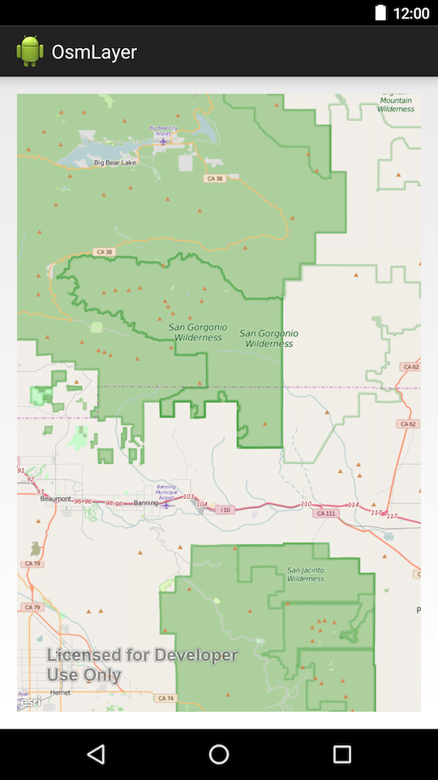

# OpenStreetMap Layer

## Features
* OpenStreetMapLayer
* MapView

## Sample Design
The `MapView` and `OpenStreetMapLayer` are constructed within the main activity using the default constructor for `OpenStreetMapLayer`
