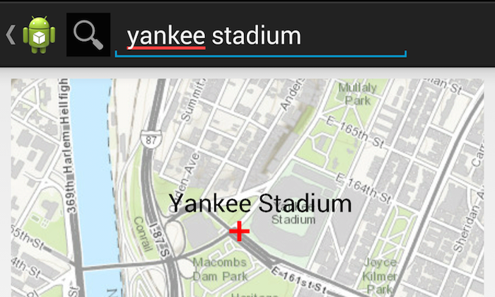

# Place Search

The PlaceSearch app usess the geocoding service to convert addresses to and from geographic coordinates. Search for places within a region and get places matching your search. 

## Sample Design
The Android API provides a Locator class that allows you to match addresses and place names to locations on the map (known as geocoding), and match locations on the map to real-world addresses (known as reverse geocoding). The locator relies on Esri's geocoding web services to perform these functions. 

## Features
* Locator
* LocatorFindParameters
* LocatorGeocodeResult
* AsyncTask
