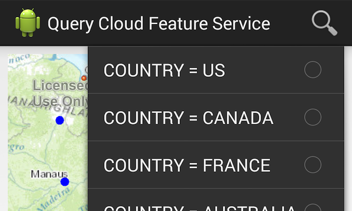

# Query Cloud Feature Service

Feature services allow you to create custom REST endpoints to store and query geographic data such as points, lines and polygons. Store custom rendering rules and metadata such as place names, ratings and addresses. Run analysis and computations against your stored data. Create hosted tile sets with baked-in feature services.

## Features
* QueryTask
* QueryParameters
* Feature Service
* Callout

## Sample Design 
The QueryCloudFeatureService app allows you to consume feature date from ArcGIS.com cloud service, select features in the layer, and perform a query on the user data.  