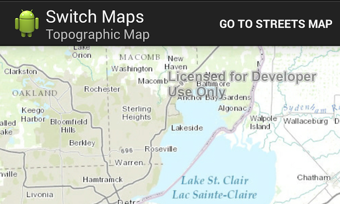

# Switch Maps



This sample shows a way to switch between two different maps in a single app by leveraging the Android Fragments pattern.

## Features
* ArcGISTiledMapServiceLayer
* Fragment

## Sample Design
In this app, a single ```MapActivity``` contains a MapFragment that in turn contains a ```MapView```. When the button on the ```ActionBar``` is pressed, the existing ```MapFragment``` is replaced by a new instance of the ```MapFragment``` that has different map contents. The current extent of the ```MapView``` is preserved when switching between fragments, by making use of the retainState and restoreState methods on the ```MapView```.