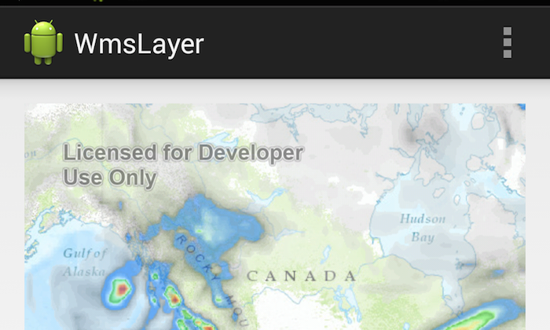

# WMS Layer



A Web Map Service (WMS) is a standard protocol for serving georeferenced map images that are generated by a map server. The specification was developed by the Open Geospatial Consortium (OGC).  This sample uses meteorological data available through a WMS service (WMS 1.1.1) by [OpenWeatherMap](http://openweathermap.org/) as an overlay layer on top of an Esri Topographic basemap.

## Features
* WMSLayer
* MapView
* MapOptions

## Sample Design
The ```MapView``` is created in the main activity layout using ```MapOptions``` to generate a topo map with default location and zoom level.  A ```WMSLayer``` is constructed using the url to the service endpoint.  The visible layers, return image format, and opacity are set on the ```WMSLayer``` through there respective method calls and the layer is added to the ```MapView```.

