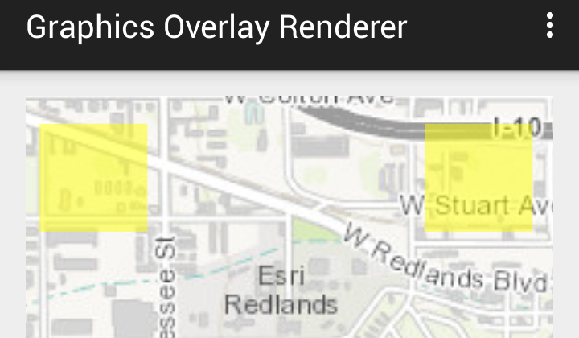

# Add Graphics Renderer



The **Add Graphics Renderer** sample demonstrates how to add ```Graphic```s to a List, create a ```SimpleRenderer``` to represent a symbol and style, and add the renderer to the ```MapView```.

## Features
* MapView
* Graphic
* GraphicsOverlay
* ListenableList
* SimpleRenderer
* SimpleMarkerSymbol

## Developer Pattern
### Renderer
Graphics are added to a ```GraphicsOverlay``` without any symbols or styles. You create a ```Renderer``` to add to the ```GraphicsOverlay``` which defines the symbol as ```SimpleMarkerSymbol``` which sets the style to be rendered.

```java
// add points from PointCollection to graphics list
for(Point pt : polyPoints){
  // add graphic to graphics overlay
    graphics.add(new Graphic(pt));
  }
// create color for graphic
Color yellow = new RgbColor(255, 255, 0, 255);
// create simple renderer
SimpleRenderer simpleRenderer = new SimpleRenderer();
// create point symbol
SimpleMarkerSymbol pointSymbol = new SimpleMarkerSymbol(yellow, 30, SimpleMarkerSymbol.Style.SQUARE);
pointSymbol.setOpacity(0.5f);
// set symbol to renderer
simpleRenderer.setSymbol(pointSymbol);
// set renderer to graphics overlay
grOverlay.setRenderer(simpleRenderer);

// add graphics overlay to the MapView
mMapView.getGraphicsOverlays().add(grOverlay);
```
