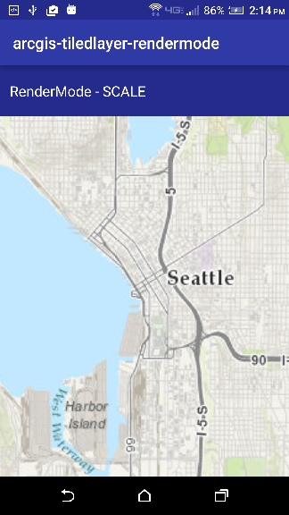
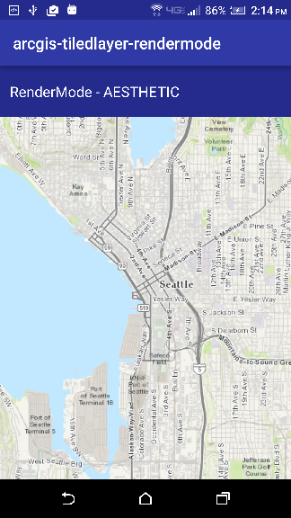

# ArcGIS Tiled Layer Render Mode

The sample demonstrates how the Tiled layer Render Mode affects what scale the layer is rendered at. There are 2 types of render modes, **SCALE** (which is the default) and **AESTHETIC**. **SCALE** always renders the layer at the scale at which the map was authored, which can result in a fuzzy effect on high DPI screens. **AESTHETIC** aims to ensure the layer renders clearly which will result in the layer's scale not being respected.        

|  RenderMode Scale                                        |  RenderMode Aesthetic                                       |
|:--------------------------------------------------------:|:-----------------------------------------------------------:|
| ||

## Features
* ArcGISTiledLayer
* Basemap
* Map
* MapView

## How to use the sample
The ArcGIS Tile Layer Render Mode app uses a Tiled layer basemap from an ArcGIS Online service URL. The **RenderMode** spinner lets to select the various possible Render Modes. The user can zoom in/out on the map to visually observe the impact of the Render Mode selected.
