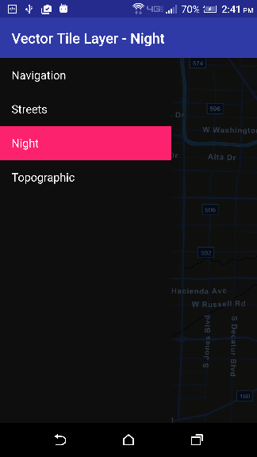
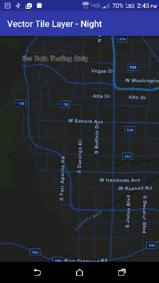

# ArcGIS Vector Tiled Layer URL




The ArcGIS Vector Tiled Layer URL app uses Vector Tiled Layer basemap from an ArcGIS Online service URL.
It shows how to inflate a MapView in the layout XML of the activity, creates a Vector Tiled Layer from an ArcGIS Online service URL and bind that to a ```Basemap```.  The ```Basemap``` is used to create a ```Map``` which is used inside of the ```MapView```. It uses Android Navigation drawer to switch between different Vector Tiled Layers. By default, this map supports basic zooming and panning operations. 

## Features
* MapView
* Map
* Basemap
* ArcGISVectorTiledLayer
