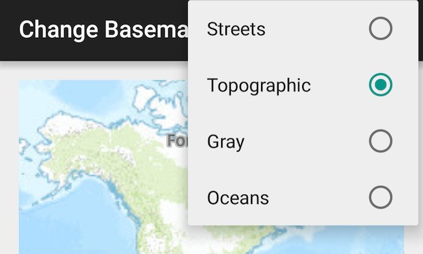

# Change Basemaps



The Change Basemaps sample app shows how you can change basemaps from the ```ActionBar``` overflow button.  You can easily add more basemaps by extending the menu items and implementing them in the ```onCreateOptionsMenu``` and ```onOptionsItemSelected``` methods.

## Features
* ArcGISMap
* MapView
* Basemap
* ViewPoint

## Sample Design
The ```ActionBar``` overflow button lists a group of basemaps to choose from.  The basemaps types are created from the ```Basemap``` class and passed to the ```Map```.
