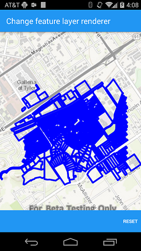
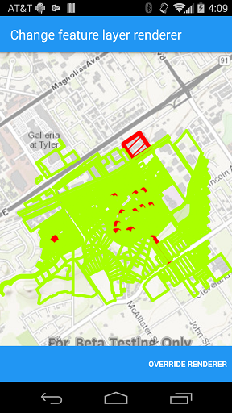

#Change feature layer renderer

|||
|-----|-----
||

##

This sample demonstrates how to override and reset a renderer of a feature layer. Use the buttons in the bottom toolbar to override or reset the renderer.
###How it works

Feature layer has a property called renderer you can set to override the renderer. Feature layer also provides a method called reset renderer to reset the renderer back to the original one that is defined in its service definition.
