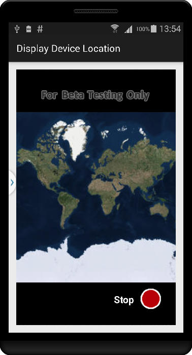
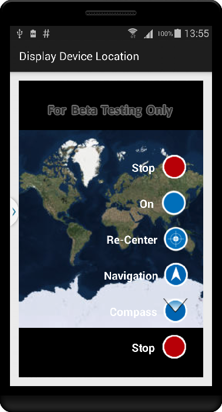
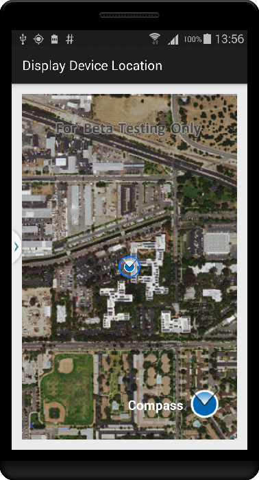
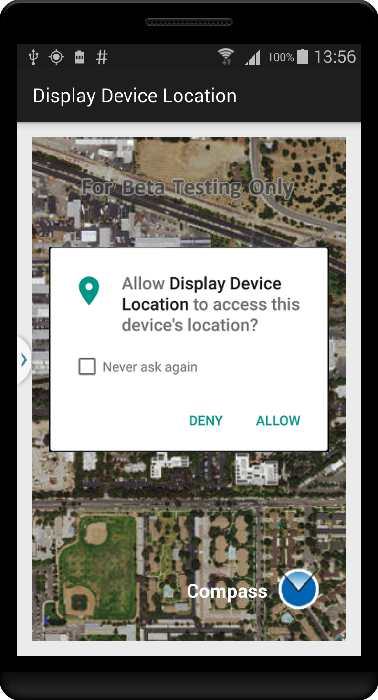

# Display Device Location       

This sample demonstrates how you can enable Location Display and switch between different types of AutoPan Modes. It also demonstrates how to use the Android Support Library to check for, and request, location permissions.






## Features
* Map
* MapView
* LocationDisplay
* LocationDisplay.AutoPanMode

## How to use the sample
This sample starts with the Map with an imagery basemap loaded in the MapView and Location display turned off. When you tap on the spinner it gives you the list of possible AutoPan Mode options along with turning the Location display on or off.

* Stop - Stops the Location Display
* On - Starts the Location Display with AutoPan Mode set to Off
* Re-Center - Starts location display with auto pan mode set to Default
* Navigation - Starts location display with auto pan mode set to Navigation
* Compass - Starts location display with auto pan mode set to Compass

## Developer Patterns

```java
private MapView mMapView;
private LocationDisplay mLocationDisplay;

....
// get the MapView's LocationDisplay
mLocationDisplay = mMapView.getLocationDisplay();

....
// Start Location Display
if (!mLocationDisplay.isStarted())
mLocationDisplay.start();

....
// Stop Location Display
if (mLocationDisplay.isStarted())
mLocationDisplay.stop();
```

The Android Support library is used to check for location permissions, and request permission if not already granted.

```java
// Check permissions to see if failure may be due to lack of permissions.
boolean permissionCheck1 = ContextCompat.checkSelfPermission(MainActivity.this, reqPermissions[0]) == PackageManager.PERMISSION_GRANTED;
boolean permissionCheck2 = ContextCompat.checkSelfPermission(MainActivity.this, reqPermissions[1]) == PackageManager.PERMISSION_GRANTED;

if (!(permissionCheck1 && permissionCheck2)) {            
  // If permissions are not already granted, request permission from the user.
  ActivityCompat.requestPermissions(MainActivity.this, reqPermissions, requestCode);
} ....
```
Permissions can only be granted at runtime if the app is running on Android API level 23 or above; for earlier API levels, permissions are requested and granted or denied at install time. For more information, see [Requesting Permissions at Run Time](http://developer.android.com/training/permissions/requesting.html).

**Note :** You still need to request user permissions in you app's Android manifest file by declaring either the ACCESS_COARSE_LOCATION or ACCESS_FINE_LOCATION permission, in order to receive location updates from NETWORK_PROVIDER or GPS_PROVIDER.

``` xml
<manifest ... >
    <uses-permission android:name="android.permission.ACCESS_COARSE_LOCATION" />
    <uses-permission android:name="android.permission.ACCESS_FINE_LOCATION" />
    ...
</manifest>
```
