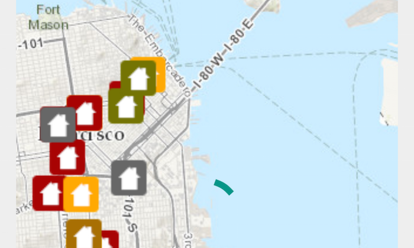

# Display Drawing Status



The **Display Drawing Status** app shows how to use the ```DrawStatus``` value representing drawing state of the ```MapView``` to display an Android ```ProgressBar``` while the map is loading.

## Features
* Map
* MapView
* ServiceFeatureTable
* DrawStatus
* DrawStatusChangedEvent
* DrawStatusChangedListener