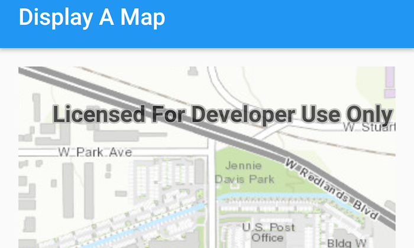

# Display a Map
The **Display Map** app is the most basic Map app for the [ArcGIS Runtime SDK for Android](https://developers.arcgis.com/en/android/).
It shows how to inflate a `MapView` in the layout XML of the activity, create a `ArcGISMap` with a static `Basemap.createImagery()` and bind the `ArcGISMap` to the `MapView`.  By default, this map supports basic zooming and panning operations.

## Features
* ArcGISMap
* MapView
* Basemap
