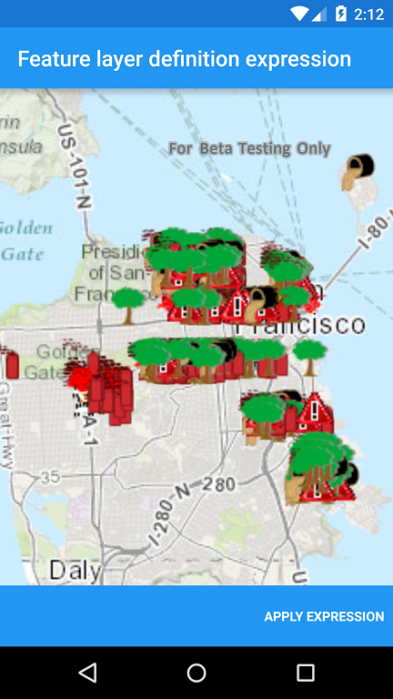
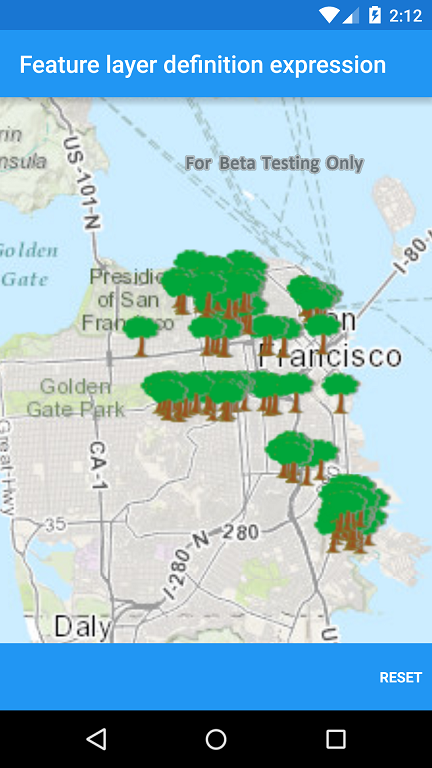

#Feature layer definition expression

##

This sample demonstrates how you can limit which features to display on the map. Use the buttons in the bottom toolbar to apply or reset definition expression.
How it works
You can achieve this by setting the definition expression property on a feature layer. It is the syntax of a SQL where clause by which to limit which features are displayed on the map.
