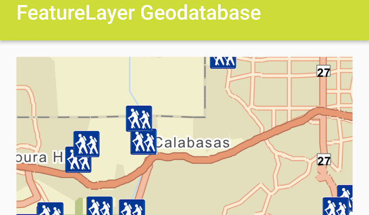

# Feature Layer GeoDatabase
This sample demonstrates how to consume an Esri mobile geodatabase by using a `FeatureLayer` and a `GeodatabaseFeatureTable`.



## Features
- ArcGISVectorTiledLayer
- FeatureLayer
- Geodatabase
- GeodatabaseFeatureTable

## Sample Pattern
The sample creates an instance of `GeodatabaseFeatureTable` by supplying the path to the local mobile geodatabase. The FeatureLayer is then supplied with the `GeodatabaseFeatureTable` and added to the Map. The mobile geodatabase can either be obtained through ArcMap, with the Create Runtime Content geoprocessing tool, or through a feature service with the `GeodatabaseSyncTask`.

```java
// create a new Geodatabase from local path
mGeodatabase = new Geodatabase(geoDbFile);
// load the geodatabase
mGeodatabase.loadAsync();
// add feature layer from geodatabase to the ArcGISMap
mGeodatabase.addDoneLoadingListener(new Runnable() {
    @Override
    public void run() {
        for (GeodatabaseFeatureTable geoDbTable : mGeodatabase.getGeodatabaseFeatureTables()){
            mMapView.getMap().getOperationalLayers().add(new FeatureLayer(geoDbTable));
        }
    }
});

// set initial viewpoint once MapView has spatial reference
mMapView.addSpatialReferenceChangedListener(new SpatialReferenceChangedListener() {
    @Override
    public void spatialReferenceChanged(SpatialReferenceChangedEvent spatialReferenceChangedEvent) {
        // set the initial viewpoint
        Point initPnt = new Point(-13214155, 4040194, SpatialReference.create(3857));
        mMapView.setViewpoint(new Viewpoint(initPnt, 35e4));
    }
});
```

## Provision your device
1. Download the data from the table below.  
2. Extract the contents of the downloaded zip file to disk.  
3. Create an ArcGIS/samples/FLGdb folder on your device. This requires you to use the [Android Debug Bridge (adb)](https://developer.android.com/guide/developing/tools/adb.html) tool found in **<sdk-dir>/platform-tools**.
4. Open up a command prompt and execute the ```adb shell``` command to start a remote shell on your target device.
5. Navigate to your sdcard directory, e.g. ```cd /sdcard/```.  
6. Create the ArcGIS/samples/FLGdb directory, ```mkdir ArcGIS/samples/FLGdb```.
7. You should now have the following directory on your target device, ```/sdcard/ArcGIS/samples/FLGdb```. We will copy the contents of the downloaded data into this directory. Note:  Directory may be slightly different on your device.
8. Exit the shell with the, ```exit``` command.
9. While still in your command prompt, navigate to the folder where you extracted the contents of the data from step 1 and execute the following command: 
	* ```adb push LosAngeles.vtpk /sdcard/ArcGIS/samples/FLGdb```
	* ```adb push LA_Trails.geodatabase /sdcard/ArcGIS/samples/FLGdb```

Link     | Local Location
---------|-------|
|[Los Angeles Vector Tile Package](https://www.arcgis.com/home/item.html?id=d9f8ce6f6ac84b90a665a861d71a5d0a)| `<sdcard>`/ArcGIS/samples/FLGdb/LosAngeles.vtpk |
|[Los Angeles Trailheads](https://www.arcgis.com/home/item.html?id=2b0f9e17105847809dfeb04e3cad69e0)| `<sdcard>`/ArcGIS/samples/FLGdb/LA_Trails.geodatabase |
