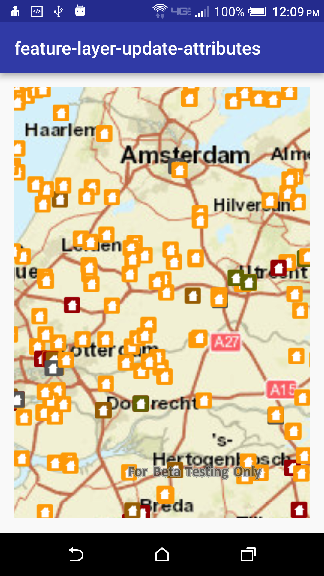
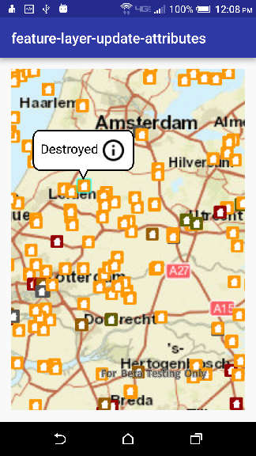

# Feature layer update attributes         

This sample demonstrates how to edit attributes of feature in a feature layer.      

|  Initial Map                                                |  Feature Selection                                          |
|:-----------------------------------------------------------:|:-----------------------------------------------------------:|
|||      

|  Options for New damage type                                |  Updated Feature Attribute                                  |
|:-----------------------------------------------------------:|:-----------------------------------------------------------:|
|||

##How to use the sample

Features in the map represent properties and are symbolized based on the type of damage to the property. Tapping on a feature displays the callout. The callout contains information about the type of damage on that property. In order to change the type of damage, tap on the info icon in the callout. Doing so, would display a list of damage types values to choose from. Selecting one of the damage types will dismiss the list and update the feature with the new value. 

## Features
* Map
* MapView
* FeatureLayer
* ArcGISFeature
* ServiceFeatureTable
* Callout
* Viewpoint
* SpatialReferences
* FeatureEditResult
* GeoElement
* IdentifyLayerResult

##How it works

The sample uses `identifyLayerAsync` method of `MapView` to identify `GeoElement` being tapped on and the `getAttributes` method on `ArcGISFeature` to get the current damage type for a selected property and displays it in the callout. After the selection of a new damage type, in order to apply the changes to the service it uses `applyEditsAsync` on the `ServiceFeatureTable` for the feature. 
