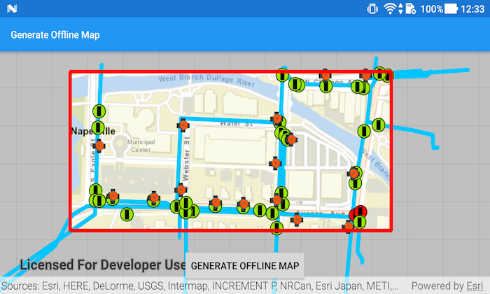

# Generate Offline Map
This sample demonstrates how to take a web map offline.

## Features
- AuthenticationView
- AuthenticationManager
- GenerateOfflineMapParameters
- GenerateOfflineMapJob
- GenerateOfflineMapResult
- OfflineMapTask
- PortalItem
- Portal

## How it works
This sample uses the `OfflineMapTask` to take a web map offline. Since this sample involves downloading map data to the local device, an ArcGIS Online account is required. Credentials are handled within the app with the `AuthenticationManager`.

The sample starts by requesting authentication from the user with the `AuthenticationManager`. On successful authentication, a `PortalItem` is created using a web map ID. The `PortalItem` is then used to initialize an `OfflineMapTask` object.

When the button is clicked, the sample creates default parameters for the task with the selected extent by calling `mOfflineMapTask.createDefaultGenerateOfflineMapParametersAsync(extent)`. Once the parameters are retrieved, they, along with the download path for the offline map, are used to create a `GenerateOfflineMapJob` object from `mOfflineMapTask`.

The job is then started and, on successful completion, the offline map from `GenerateOfflineMapJob.getResult().getOfflineMap()` is added to the map view. Progress of the `GenerateOfflineMapJob` is displayed in an Android progress dialog.
