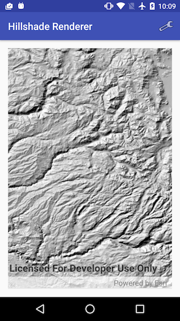
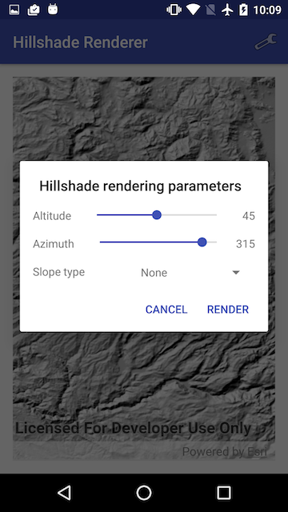

# Hillshade renderer

This sample demonstrates how to use hillshade renderer on a raster

## How to use the sample

Tap on the wrench button in the Action Bar to change the settings for the `HillshadeRenderer`. The sample allows you to change the `Altitude`, `Azimuth` and `Slope type`. You can tap on the `Render` button to update the raster.

## How it works

The sample uses the `HillshadeRenderer` class to render new hillshades. The parameters provided by the user are passed to `HillshadeRender` at instantiation: `new HillshadeRenderer(mAltitude, mAzimuth, mZFactor, mSlopeType, mPixelSizeFactor, mPixelSizePower, mOutputBitDepth);` which returns a `RasterRenderer`. The `RasterRenderer` is then added to the `RasterLayer`. 
