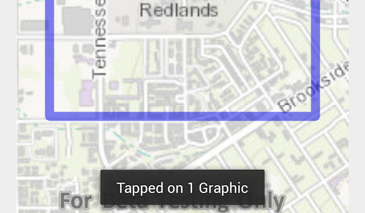

# Identify Graphics Hit Test



The **Identify Graphics Hit Test** sample demonstrates how to create a ```Graphic``` and add it to a ```GraphicOverlay``` where it can be identified from the ```MapView```.

## Features
* ArcGISMap
* MapView
* DefaultMapViewOnTouchListener
* Graphic
* GraphicsOverlay

## Developer Pattern
### Graphics
Graphics represent graphic elements used in graphic overlays on the ```MapView```. Graphics are contained in a modifiable ```List``` for graphics on a ```GraphicsOverlay```.  The ```ListenableList``` interface defines a listenable ```List``` of graphics that can be notified when items are being added or removed from the ```List```.

```java
// create list of graphics
ListenableList<Graphic> graphics = grOverlay.getGraphics();
// add graphic to graphics overlay
graphics.add(graphic);
// add graphics overlay to the MapView
mMapView.getGraphicsOverlays().add(grOverlay);
```

### Identify Graphics Overlay
You can identify on a graphics overlay from the ```MapView.identifyOnGraphicsOverlay()``` method which returns a ```ListenableFuture<List<Graphic>>```.  Futures are an abstraction for asynchronous event driven systems that the Android platform provides.  The method returns immediately as a wrapper around the ```List<Graphic>```, once the asynchronous event is completed you can access it with ```ListenableFuture.get()```.

```java
// identify graphics on the graphics overlay
final ListenableFuture<List<Graphic>> identifyGraphic = mMapView.identifyGraphicOverlay(grOverlay, screenPoint, 10, 2);

identifyGraphic.addDoneListener(new Runnable() {
  @Override
  public void run() {
    try {
      // get the list of graphics returned by identify
      List<Graphic> graphic = identifyGraphic.get();
      // get size of list in results
      int identifyResultSize = graphic.size();
    }catch(InterruptedException | ExecutionException ie){
      ie.printStackTrace();
    }
  }
```
