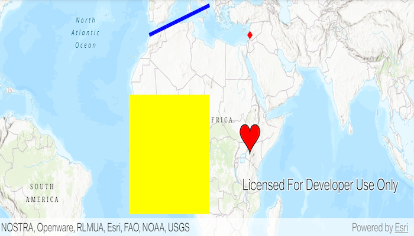

# Add graphics with renderer

A renderer allows you to change the style of all graphics in a graphics overlay by referencing a single symbol style.
A renderer will only effect graphics that do not specify their own symbol style.

## Use case

A renderer allows you to change the style of all graphics in an overlay by only changing one copy of the symbol. For example, a user may wish to display a number of graphics on a map of parkland which represent trees, all sharing a common symbol.

## How to use the sample

Run the sample and view graphics for points, lines, and polygons, which are stylized using renderers.

## How it works

* Create a `GraphicsOverlay` and add it to the `MapView`.
* Create a `Graphic`, specifying only a `Geometry`.
* Create a single `Symbol` such as a `SimpleMarkerSymbol`.
* Create a renderer with the `Symbol` such as a `SimpleRenderer(symbol)`.
* Set the renderer on the `GraphicsOverlay` with `graphicsOverlay.setRenderer(renderer)`.

## Relevant API

* CubicBezierSegment
* EllipticArcSegment
* Geometry
* Graphic
* GraphicsOverlay
* MutablePart
* PolygonBuilder
* PolylineBuilder
* SimpleFillSymbol
* SimpleLineSymbol
* SimpleMarkerSymbol
* SimpleRenderer

## Additional information

To set unique symbols across a number of graphics (e.g. showing graphics of individual landmarks) see the "Add graphics with symbols" sample.

## Tags

arc, bezier, curve, display, graphics, marker, overlay, renderer, segment, symbol, true curve
