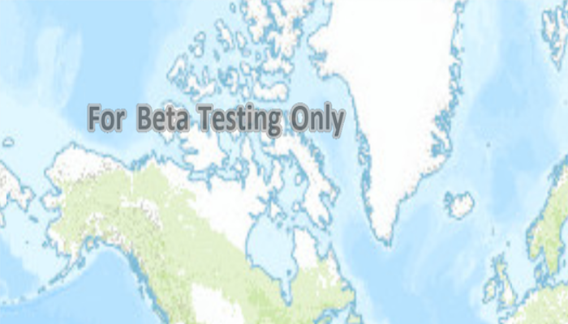

# ArcGIS tiled layer URL

Load an ArcGIS tiled layer from a URL.

## Use case

A tiled layer consumes raster tiles provided by an ArcGIS service or a tile package (.tpk & .tpkx). Dividing a raster into tiles provides the user with relevant tiles and level of detail while panning and zooming, allowing for rapid map visualization and navigation. For example, say you wanted an application with a map containing all museums in your city so that you could share this with tourists. Since only the museums would need to support being identifiable or queryable within the app, all other contextual information required to orient and direct the tourists could be sourced from a single ArcGIS tiled layer, leading to faster performance and minimizing the time to load the map.

## How to use the sample	

Launch the app to view the "World Topographic Map" tile layer as the basemap. 

## How it works

1. Create a `ArcGISTiledLayer` object from a URL.
2. Create a `Basemap` passing in the tiled layer.
3. Create an `ArcGISMap` with the basemap.
4. Set the map on the `MapView`.

## Relevant API

* ArcGISMap
* ArcGISTiledLayer
* Basemap
* MapView

## About the data

The application utilizes the "World Topographic Map" tile layer. This presents a simple yet powerful illustration of adding visualization context to a basemap through the use of an ArcGIS tiled layer.

## Additional information

An ArcGISTiledLayer can also be added to the ArcGISMap as a layer, but it's best practice to use as a basemap since its purpose is to provide geographical context. ArcGIS tiled layers do not support reprojection, query, select, identify, or editing.

## Tags

basemap, layers, raster tiles, tiled layer, visualization
