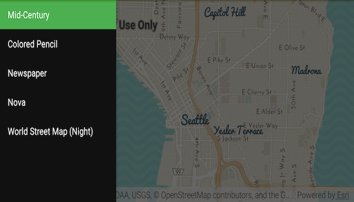

# ArcGIS Vector Tiled Layer URL
Load an ArcGIS Vector Tiled Layer from a URL.



## How to use the sample
Simply run the app.

## How it works
An `ArcGISVectorTiledLayer` from an ArcGIS Online service URL is added to the `ArcGISMap` as an operational layer.

```java
// inflate MapView from layout
mMapView = (MapView) findViewById(R.id.mapView);

// create new Vector Tiled Layer from service url
mVectorTiledLayer = new ArcGISVectorTiledLayer(
    getResources().getString(R.string.navigation_url));

// set tiled layer as basemap
Basemap basemap = new Basemap(mVectorTiledLayer);
// create a map with the basemap
ArcGISMap map = new ArcGISMap(basemap);
// create a viewpoint from lat, long, scale
Viewpoint vp = new Viewpoint(47.606726, -122.335564, 72223.819286);
// set initial map extent
map.setInitialViewpoint(vp);
// set the map to be displayed in this view
mMapView.setMap(map);
```

## Relevant API
* ArcGISMap
* ArcGISVectorTiledLayer
* Basemap
* MapView

#### Tags
Layers