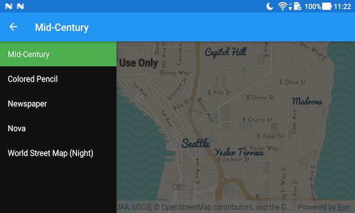

# ArcGIS Vector Tiled Layer URL
### Category: Visualization


This app creates `Basemap`s from an `ArcGISVectorTiledLayer` which is pointed to an ArcGIS Vector Tile Service.
It shows how to inflate a `MapView` in the layout XML of the activity, creates a `ArcGISVectorTiledLayer` from an ArcGIS Online service URL and bind that to a `Basemap`.  The `Basemap` is used to create a `Map` which is used inside of the `MapView`. It uses Android Navigation drawer to switch between different Vector Tiled Layers. By default, this map supports basic zooming and panning operations.

## Features
* MapView
* ArcGISMap
* Basemap
* ArcGISVectorTiledLayer

## Developer Pattern
```java
// inflate MapView from layout
mMapView = (MapView) findViewById(R.id.mapView);

// create new Vector Tiled Layer from service url
mVectorTiledLayer = new ArcGISVectorTiledLayer(
    getResources().getString(R.string.navigation_url));

// set tiled layer as basemap
Basemap basemap = new Basemap(mVectorTiledLayer);
// create a map with the basemap
ArcGISMap map = new ArcGISMap(basemap);
// create a viewpoint from lat, long, scale
Viewpoint vp = new Viewpoint(47.606726, -122.335564, 72223.819286);
// set initial map extent
map.setInitialViewpoint(vp);
// set the map to be displayed in this view
mMapView.setMap(map);
```
