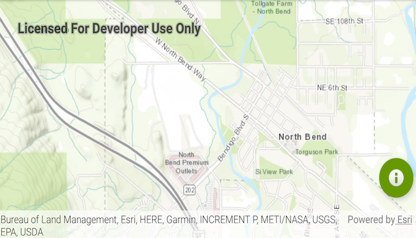

# Attribution View Change
This sample demonstrates showing UI components responding to attribution view.

## How to use the sample
Click on the attribution bar to expand it and see how the floating action button moves up. Click the attribution bar to minimize it and see how the floating action button moves down. 

## How it works
* Add a layout change listener to the Map View with `addAttributionViewLayoutChangeListener`.
* Get the difference in pixels by using `hightDelta = oldBottom - bottom`.
* Move the floating action button along the `MapView` with `animate().translationYBy(heightDelta)`.

## Relevant API
* ArcGISMap
* Basemap

#### Tags
MapViews, SceneViews and UI
