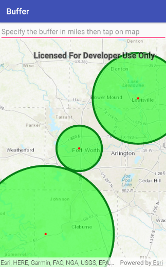

<h1>Buffer</h1>

This sample demonstrates how to generate a polygon of a fixed distance around a point.

Creating buffers is a core concept in GIS as it allows for proximity analysis to find geographic features contained 
within a polygon. For example, suppose you wanted to know how many restaurants are within a short walking distance of
 your home. The simplest proximity analysis would be to generate a buffer polygon of a certain distance 
 (say 1 mile) around your house.

<h2>How to use the sample</h2>

Tap on the map to create a buffer around the tapped location. Change the spinner value (in miles) to set the 
buffer distance.

<h2>How it works</h2>

To create a Polygon with a radius:

<ol>
<li>The static method, <code>GeometryEngine.buffer</code>, is called by passing in a <code>Point</code> and a distance
 in meters. This returns a <code>Polygon</code> which can be displayed using a <code>Graphic</code>.</li>
</ol>

<h2>Features</h2>
<ul>
<li>GeometryEngine.Buffer</li>
<li>GraphicsOverlay</li>
<li>Point</li>
<li>Polygon</li>
</ul>

<h2>Tags</h2>
<ul>
<li>Analysis</li>
<li>Buffer</li>
<li>GeometryEngine</li>
</ul>
