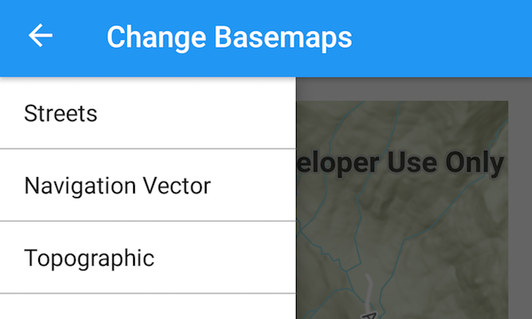

# Change Basemaps
Change basemaps from an Android Navigation Drawer.

## How to use the sample
Use the navigation drawer to select basemaps.

## How it works
The `selectBasemaps()` method switches Basemaps based on the position of the navigation drawer selection. The Basemap is created from create methods on a `Basemap` object.  

## Relevant API
* ArcGISMap
* Basemap
* MapView
* ViewPoint

#### Tags
Maps and Scenes