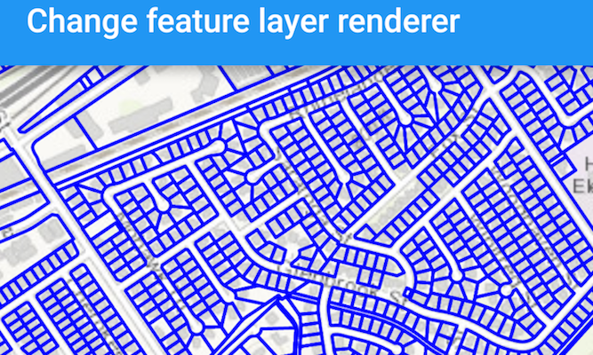

# Change feature layer renderer

Change the appearance of a feature layer with a renderer.

## Use case

A feature layer hosted on ArcGIS Online has a preset renderer and will display in an ArcGIS Runtime application with that renderer. However, for example, the color associated with the original renderer may be unsuitable for a company with staff or clients who are color blind, or for presentation with a different set of basemap and operational layers. In these cases, the renderer on the feature layer's data can be set to a more suitable color.

## How to use the sample
Tap the 'Override Renderer' button to change the `FeatureLayer`'s renderer.

## How it works

1. Create a `ServiceFeatureTable` from a URL.
2. Create a `FeatureLayer` from the service feature table.
3. Create a new renderer (in this case, a `SimpleRenderer`).
4. Change the feature layer's renderer using `FeatureLayer.setRenderer(SimpleRenderer)`.

## Relevant API

* FeatureLayer
* ServiceFeatureTable
* SimpleRenderer

## About the data
This sample displays a feature layer showing pool permit statuses in California.

## Tags

feature layer, renderer, visualization
