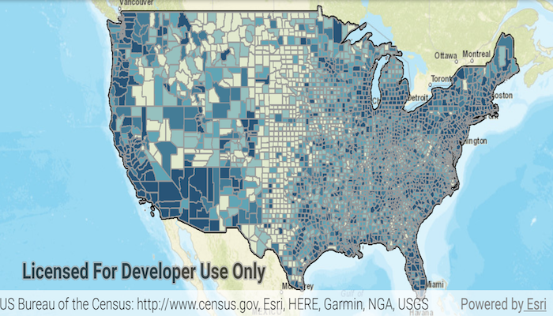

# Change Sublayer Renderer
Change the renderer on a map image layer sublayer. In this example, a renderer is applied 
to see the different population ranges in the counties sublayer data.

## How to use the sample
Wait for the map image layer to load. Then click the "Change sublayer renderer" button to set the renderer.

## How it works
To get a sublayer and change its renderer:

1. Create an ArcGIS map image layer from its URL.
1. After it is done loading, get its `SublayerList` with `imageLayer.getSublayers()`.
1. Cast the sublayer you want to change to the appropriate type: `(ArcGISMapImageSublayer) sublayers.get(2)`.
1. Set the renderer with `sublayer.setRenderer(renderer)`.

## Relevant API
* ArcGISMap 
* ArcGISMapImageLayer 
* ArcGISMapImageSublayer 
* Basemap 
* ClassBreaksRenderer 
* ClassBreaksRenderer.ClassBreak 
* LoadStatus 
* MapView 
* SimpleFillSymbol 
* SimpleLineSymbol 
* SublayerList 

#### Tags
Visualization 
