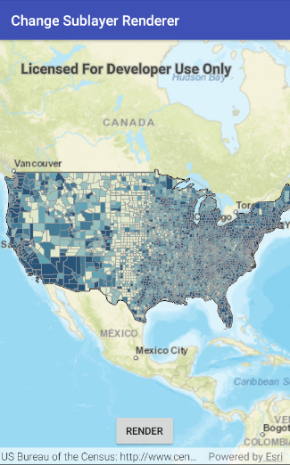

<h1>Change Sublayer Renderer</h1>

Demonstrates how to change the renderer on a map image layer sublayer. In this example, a renderer is applied 
to see the different population ranges in the counties sublayer data.

<h2>How to use the sample</h2>

Wait for the map image layer to load. Then click the "Change sublayer renderer" button to set the renderer.

<h2>How it works</h2>

To get a sublayer and change its renderer:

<ol>
    <li>Create an ArcGIS map image layer from its URL.</li>
    <li>After it is done loading, get its <code>SublayerList</code> with <code>imageLayer.getSublayers()</code>.</li>
    <li>Cast the sublayer you want to change to the appropriate type: <code>(ArcGISMapImageSublayer) sublayers.get(2)
    </code>.</li>
    <li>Set the renderer with <code>sublayer.setRenderer(renderer)</code>.</li>
</ol>

<h2>Features</h2>

<ul>
    <li>ArcGISMap</li>
    <li>ArcGISMapImageLayer</li>
    <li>ArcGISMapImageSublayer</li>
    <li>Basemap</li>
    <li>ClassBreaksRenderer</li>
    <li>ClassBreaksRenderer.ClassBreak</li>
    <li>LoadStatus</li>
    <li>MapView</li>
    <li>SimpleFillSymbol</li>
    <li>SimpleLineSymbol</li>
    <li>SublayerList</li>
</ul>
