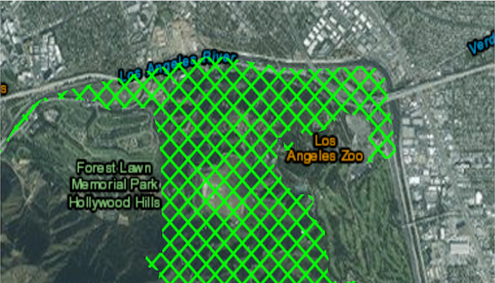

# Change Viewpoint
Set the ViewPoint of a map. 

## How to use the sample
Three methods are demonstrated to change the view point namely:
* Geometry: Zoom to a real-world feature - Griffith Park by creating geometry from JSON file.
* Center and Scale: Zoom to Waterloo.
* Animation: Set the map views's viewpoint to London with a ten second duration  .

## How it works
1. Create a `Point` and use it to create a `Viewpoint`.
1. Set the `MapView`'s viewpoint with `setViewPointWithDurationAsync` or `setViewpointCenterWithScaleAsync`.

## Relevant API
* MapView
* setViewpointCenterWithScaleAsync
* setViewpointGeometryAsync
* setViewpointWithDurationAsync
* setViewpointCenterWithScaleAsync
* SpatialReference

#### Tags
MapViews, SceneViews and UI