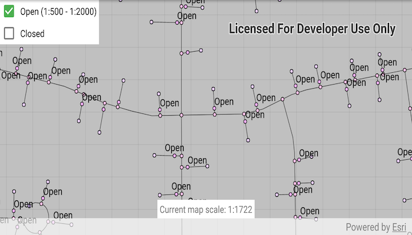

# Control annotation sublayer visibility

Use annotation sublayers to gain finer control of annotation layer subtypes.

## Use case

Annotation, which differs from labels by having a fixed place and size, is typically only relevant at particular scales. Annotation sublayers allow for finer control of annotation by allowing properties (like visibility in the map and legend) to be set and others to be read (like name) on subtypes of an annotation layer.

An annotation dataset which marks valves as "Opened" or "Closed", might be set to display the "Closed" valves over a broader range of scales than the "Opened" valves, if the "Closed" data is considered more relevant by the map's author. Regardless, the user can be given a manual option to set visibility of annotation sublayers on and off, if required.

## How to use the sample

Start the sample and take note of the visibility of the annotation. Zoom in and out to see the annotation turn on and off based on scale ranges set on the data.

Use the checkboxes to manually set "Open" and "Closed" annotation sublayers visibility to on or off.

## How it works

1. Load the `MobileMapPackage`.
2. Populate checkbox text with the `AnnotationSublayer` names (including maximum and minimum scales, where relevant).
3. Wire up the checkboxes to toggle the annotation sublayer's visibility.
4. Add a listener for changes in map view navigation and add code to:
  * Update the current scale UI element at the bottom of the screen on navigation.
  * Set the "Open" annotation sublayer checkbox text to:
     * Black, when the layer is drawn at the current map scale
     * Light gray, when the layer is not drawn at the current map scale

## Relevant API

* AnnotationLayer
* AnnotationSublayer
* LayerContent

## Offline Data

1. Download the data from [ArcGIS Online](https://arcgisruntime.maps.arcgis.com/home/item.html?id=b87307dcfb26411eb2e92e1627cb615b).
2. Open your command prompt and navigate to the folder where you extracted the contents of the data from step 1.
3. Push the data into the scoped storage of the sample app:
`adb push GasDeviceAnno.mmpk /Android/data/com.esri.arcgisruntime.sample.controlannotationsublayervisibility/files/GasDeviceAnno.mmpk`

## About the data

 The scale ranges were set by the map's author using ArcGIS Pro:
* The "Open" annotation sublayer has its maximum scale set to 1:500 and its minimum scale set to 1:2000.
* The "Closed" annotation sublayer has no minimum or maximum scales set, so will be drawn at all scales.

## Tags

annotation, scale, text, utilities, visualization
