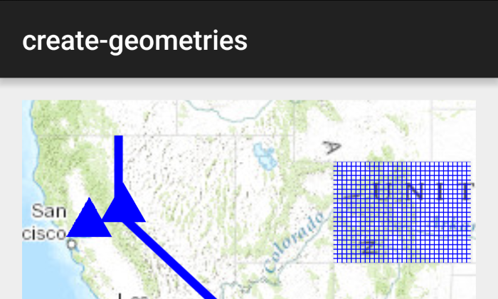

# Create geometries

Create simple geometry types.

## Use case

Geometries are used to represent real world features as vector GIS data. Points are used to mark specific XY locations, such as landmarks and other points of interest. Polylines are made up of 2 or more XY vertices and can be used to mark roads, flight paths, or boundaries. Polygons are made up of 3 or more XY vertices and can be used to represent a lake, country, or a park. Geometries can be stored as features in a database, displayed as Graphics in a map, or used for performing spatial analysis with `GeometryEngine` or a `GeoprocessingTask`.

## How to use the sample

Pan and zoom freely to see the different types of geometries placed onto the map.

## How it works

1. Use the constructors for the various simple `Geometry` types including `Point`, `Polyline`, `Multipoint`, `Polygon`, and `Envelope`.
2. To display the geometry, create a `Graphic` passing in the geometry, and a `Symbol` appropriate for the geometry type.
3. Add the graphic to a graphics overlay and add the overlay to a map view.

## Relevant API

* Envelope
* Multipoint
* Point
* PointCollection
* Polygon
* Polyline

## Additional information

A geometry made of multiple points usually takes a `PointCollection` as an argument or is created through a builder.

## Tags

area, boundary, line, marker, path, shape