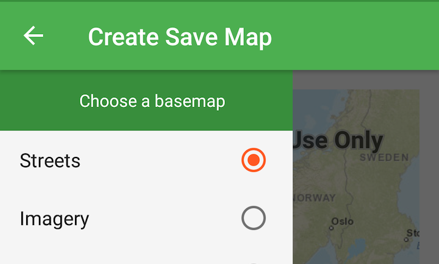

# Create and Save a Map
Create a map and save it to your portal.

## How to use the sample
This sample uses the [named user login](https://developers.arcgis.com/authentication/#named-user-login) authentication pattern. Before a user can save a map they have to login to their [ArcGIS Online](https://www.arcgis.com/) account.

1. Open the navigation drawer by tapping on the Drawer Toggle or sliding right from the left side of the screen. 
1. Choose basemap and operational layers to create a map. 
1. Tap on save menu option on the right-hand side of the action bar to save the map.
1. Enter a title, tags and description for your map and then hit 'Save Map'.
1. Enter your credentials when prompted and your map will be saved to your [ArcGIS Online](https://www.arcgis.com/) account.

## How it works
1. Create an `AuthenticationChallengeHandler` and set it to the `AuthenticationManager`.
1. Connect to your `Portal`.
1. Use `ArcGISMap.saveAsAsync` passing in the `Portal`, and information about the map, to save the map to the portal.

NOTE: The app uses OAuth2 protocol to authenticate the named users.  In order to do that the app must declare an Activity and intent filter to redirect the URI. This will parse the authorization code from the response URI and use it to fetch the `OAuthTokenCredential`.

## Relevant API
* ArcGISMap
* OAuthLoginManager
* OAuthTokenCredential
* Portal
* PortalSettings
* PortalItem

#### Tags
Edit and Manage Data