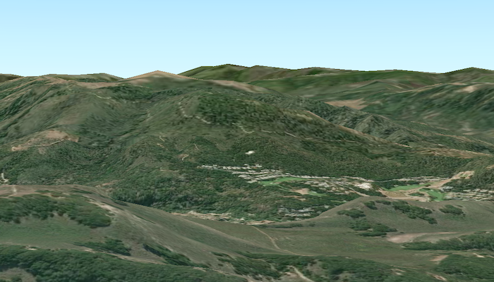

# Create terrain from a local raster

Set the terrain surface with elevation described by a raster file.

## Use case

The terrain surface is what the basemap, operational layers, and graphics are draped on. Supported raster formats include:

* ASRP/USRP
* CIB1, 5, 10
* DTED0, 1, 2
* GeoTIFF
* HFA
* HRE
* IMG
* JPEG
* JPEG 2000
* NITF
* PNG
* RPF
* SRTM1, 2

## How it works

1. Create an `ArcGISScene` and add it to a `SceneView`.
1. Create a `RasterElevationSource` with a list of raster file paths.
1. Add this source to the scene's base surface: `ArcGISScene.getBaseSurface().getElevationSources().add(RasterElevationSource)`.

## Relevant API

- RasterElevationSource
- Surface

## About the data

This raster data comes from Monterey, California.

## Offline data

1. Download the data from [ArcGIS Online](https://arcgisruntime.maps.arcgis.com/home/item.html?id=98092369c4ae4d549bbbd45dba993ebc).
1. Extract the contents of the downloaded zip file to disk.
1. Open your command prompt and navigate to the folder where you extracted the contents of the data from step 1.
1. Execute the following command:

`adb push MontereyElevation.dt2 /Android/data/com.esri.arcgisruntime.sample.createterrainfromalocalraster/files/MontereyElevation.dt2`

Link | Local Location
---------|-------|
|[Monterey Elevation Raster File](https://arcgisruntime.maps.arcgis.com/home/item.html?id=98092369c4ae4d549bbbd45dba993ebc)| /Android/data/com.esri.arcgisruntime.sample.createterrainfromalocalraster/files/MontereyElevation.dt2 |

#### Tags
Maps & Scenes
3D
Raster
Elevation
Surface
