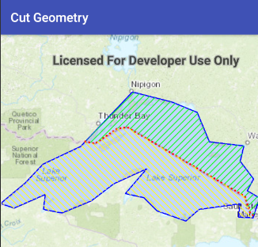

<h1>Cut Geometry</h1>

Demonstrates how to cut a geometry with a polyline using the GeometryEngine.

<h2>How to use the sample</h2>

Click the "Cut" button to cut the polygon with the polyline and see the resulting parts.

<h2>How it works</h2>

To cut a geometry with a polyline:

<ol>
    <li>Use the static method <code>GeometryEngine.cut(geometry, polyline)</code>.</li>
    <li>Loop through the <code>List&lt;Geometry&gt;</code> of cut pieces. Keep in mind that some of these geometries may
     be multi-part.</code>
</ol>

<h2>Features</h2>

<ul>
    <li>ArcGISMap</li>
    <li>Basemap</li>
    <li>Geometry</li>
    <li>GeometryEngine</li>
    <li>Graphic</li>
    <li>GraphicsOverlay</li>
    <li>MapView</li>
    <li>Point</li>
    <li>PointCollection</li>
    <li>Polygon</li>
    <li>Polyline</li>
    <li>SimpleFillSymbol</li>
    <li>SimpleLineSymbol</li>
    <li>SpatialReferences</li>
</ul>
