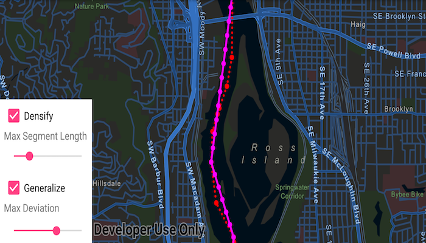

# Densify and Generalize 
Demonstrates how to densify or generalize a polyline geometry. In this example, points representing a ships location are shown at irregular intervals. One can densify the polyline connecting these lines to interpolate points along the line at regular intervals. Generalizing the polyline can also simplify the geometry while preserving its general shape.

## How to use the sample 
Use the sliders to control the parameters of the densify and generalize methods. You can deselect the checkboxes for either method to remove its effect from the result polyline. You can also hide the result to only see the original by deselecting the "Show result" checkbox.

## How it works
To densify and generalize a polyline 
1. Use the static method `GeometryEngine.densify(polyline, maxSegmentLength)` to densify the polyline . The resulting polyline will add points along the line so that there are no points greater than `maxSegmentLength` from the next point.
2. Use the static method `GeometryEngine.generalize(polyline, maxDeviation, true)` to generalize the polyline. The resulting polyline will have points or shifted from the line to simplify the shape. None of these points can deviate farther from the original line than `maxDeviation`. The last parameter, `removeDegenerateParts` , will clean up extraneous parts if the geometry is multi-part it will have no effect in this sample.
3. Note that `maxSegmentLength` and `maxDeviation` are in the units of geometry's coordinate system. This could be in degrees in some coordinate systems. In this example, a cartesian coordinate system is used and at a small enough scale that geodesic distances are not required.

## Relevant API
* ArcGISMap
* Basemap
* GeometryEngine
* Graphic
* GraphicsOverlay
* MapView
* Multipoint
* Point
* PointCollection
* Polyline
* SimpleLineSymbol
* SimpleMarkerSymbol
* SpatialReference

#### Tags
Edit and Manage Data
