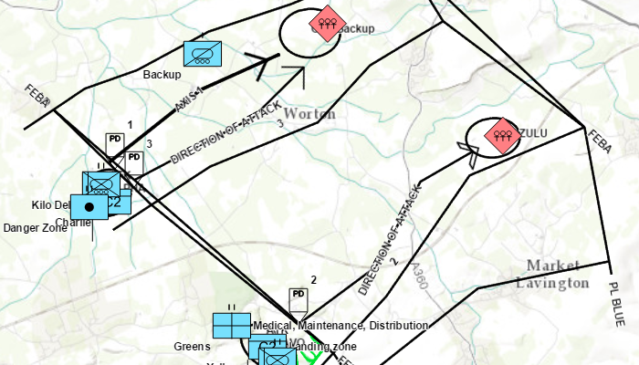

# Dictionary renderer with graphics overlay

Create graphics using a local mil2525d style file and an XML file with key/value pairs for each graphic.

## Use case

Use a dictionary renderer on a graphics overlay to display more transient data, such as military messages coming through a local tactical network.

## How to use the sample

Run the sample and view the military symbols on the map.    

## How it works

1. Create a new `DictionarySymbolStyle` with `DictionarySymbolStyle.createFromFile()`.
2. Create a new `DictionaryRenderer`, passing in the `symbolDictionary`.
3. Create a new `GraphicsOverlay`.
4. Set the  dictionary renderer to the graphics overlay.
5. Parse through the local XML file creating a map of key/value pairs for each block of attributes.
6. Create a `Graphic` for each attribute.
7. Use the `_wkid` key to get the geometry's spatial reference.
8. Use the `_control_points` key to get the geometry's shape.
9. Add the graphic to the graphics overlay.

## Relevant API

* DictionaryRenderer
* DictionarySymbolStyle
* GraphicsOverlay

## Offline data

1. Download the data from the table below.
2. Extract the contents of the downloaded zip file to disk.  
3. Create an ArcGIS/samples/Dictionary folder on your device. You can use the [Android Debug Bridge (adb)](https://developer.android.com/guide/developing/tools/adb.html) tool found in **<sdk-dir>/platform-tools**.
4. Open up a command prompt and execute the `adb shell` command to start a remote shell on your target device.
5. Navigate to your sdcard directory, e.g. `cd /sdcard/`.  
6. Create the ArcGIS/samples/Dictionary directory, `mkdir ArcGIS/samples/Dictionary`.
7. You should now have the following directory on your target device, `/sdcard/ArcGIS/samples/Dictionary`. We will copy the contents of the downloaded data into this directory. Note:  Directory may be slightly different on your device.
8. Exit the shell with the, `exit` command.
9. While still in your command prompt, navigate to the folder where you extracted the contents of the data from step 1 and execute the following command:
	* `adb push mil2525d.stylx /sdcard/ArcGIS/samples/Dictionary`

Link | Local Location
---------|-------|
|[Mil2525d Stylx File](https://www.arcgis.com/home/item.html?id=c78b149a1d52414682c86a5feeb13d30)| `<sdcard>`/ArcGIS/samples/Dictionary/mil2525d.stylx |

### Tags

defense, military, situational awareness, tactical, visualization
