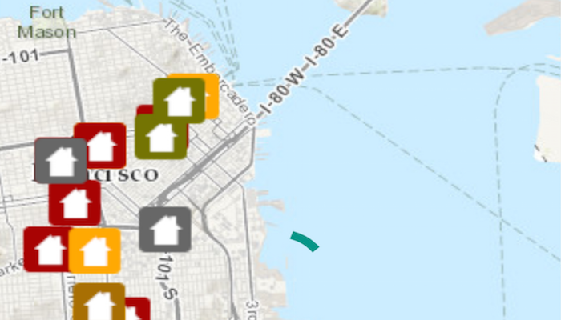

# Display drawing status

Get the draw status of your map view or scene view to know when all layers in the map or scene have finished drawing.

## Use case

You may want to display a loading indicator while layers are loading, which could then be removed on `DrawStatus.COMPLETED`.

## How to use the sample

Pan and zoom around the map. Observe how the status bar changes from a loading animation to invisible, indicating that drawing has completed.

## How it works

1. Create a `MapView` and add a `DrawStatusChangedListener` to it.
2. Use `getDrawStatus` on the `DrawStatusChangedEvent` to determine draw status.

## Relevant API

* ArcGISMap
* DrawStatus
* DrawStatusChangedEvent
* DrawStatusChangedListener
* MapView

## Tags

draw, loading, map, render
