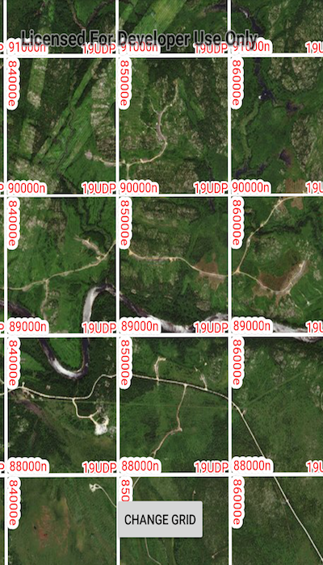

# Display grid

Display coordinate system grids including Latitude/Longitude, MGRS, UTM and USNG on a map view. Also, toggle label visibility and change the color of grid lines and grid labels.

## Use case

Grids are often used on printed maps, but can also be helpful on digital maps, to identify locations on a map.

## How to use the sample

Tap on the `Change Grid` button to open a settings view. You can select type of grid from `Grid Type` (LatLong, MGRS, UTM and USNG) and modify its properties like label visibility, grid line color, and grid label color.

## How it works

1. Create an instance of one of the `Grid` types.
2. Grid lines and labels can be styled per grid level with `setLineSymbol(gridLevel, lineSymbol)` and `setTextSymbol(gridLevel, textSymbol)` methods on the grid.
3. The label position can be set with `setLabelPosition(labelPosition)` method on the grid.
4. For the `LatitudeLongitudeGrid` type, you can specify a label format of `DECIMAL_DEGREES` or `DEGREES_MINUTES_SECONDS`.
5. To set the grid, use the `setGrid(grid)` method on the map view.

## Relevant API

* Grid
* LatitudeLongitudeGrid
* MapView
* MgrsGrid
* SimpleLineSymbol
* TextSymbol
* UsngGrid
* UtmGrid

## Tags

coordinates, degrees, graticule, grid, latitude, longitude, MGRS, minutes, seconds, USNG, UTM
