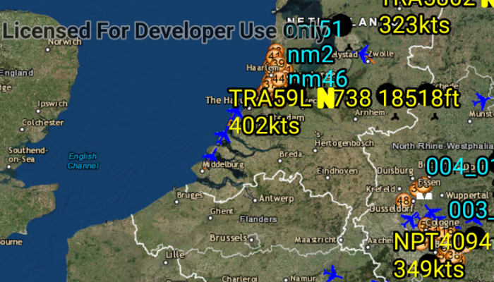

# Display KML Network Links
KML files can reference other KML files on the network as well as refresh intervals. This can be used to create a map that will periodically refresh itself with the latest data. This sample demonstrates how to display a file with a network link.

## How to use the sample

The data shown should refresh automatically every few seconds. A network message will be displayed when the dataset is loaded.

## How it works

To show KML with network links and display network messages:

1. Create a `KmlDataset` from a KML source which has network links.
1. Construct a `KmlLayer` with the dataset and add the layer as an operational layer.
1. To listen for network messages, add a `KmlNetworkLinkMessageReceivedListener` on the dataset.

## Relevant API

* KmlDataset
* KmlLayer
* KmlNetworkLinkMessageReceivedEvent

## About the data

This map shows the current air traffic in parts of Europe with heading, altitude, and ground speed. Additionally, noise levels from ground monitoring stations are shown.

## Tags

Layers, KML, KMZ, OGC, Keyhole, Network Link, Network Link Control.