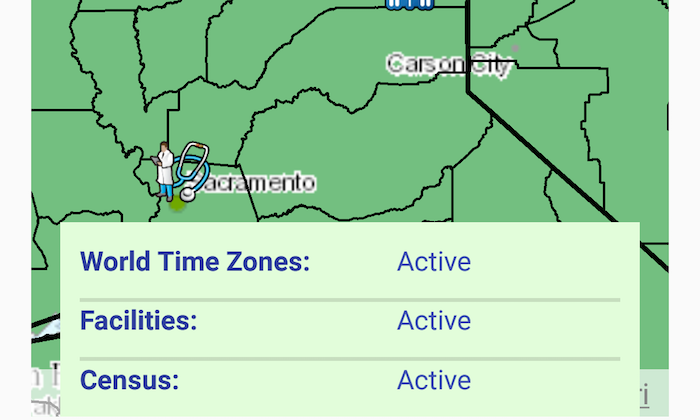

# Display layer view state

Determine if a layer is currently being viewed.

## Use case

The view state includes information on the loading state of layers and whether layers are visible at a given scale. You might change how a layer is displayed in a layer list to communicate whether it is being viewed in the map. For example, you could show a loading spinner next to its name when the view state is LOADING, gray out the name when NOT_VISIBLE or OUT_OF_SCALE, show the name normally when ACTIVE, or with an error icon when the state is ERROR.

## How to use the sample

Pan and zoom around the map. Each layer's view status is displayed. Notice that some layers configured with a min and max scale change to `OUT_OF_SCALE` at certain scales.

## How it works

1. Create an `ArcGISMap` with some operational layers.
2. Set the map on a `MapView`.
3. Listen to `LayerViewStateChangedEvents` from the map view.
4. Get the `Layer` for the event with `event.getLayer()` and the current view status with `event.getLayerViewStatus()`.

## Relevant API

* ArcGISMap
* LayerViewStateChangedEvent
* LayerViewStateChangedListener
* MapView

## About the data

The map shows a tiled layer of world time zones, a map image layer of the census, and a feature layer of recreation services.

## Tags

layer, map, status, view
